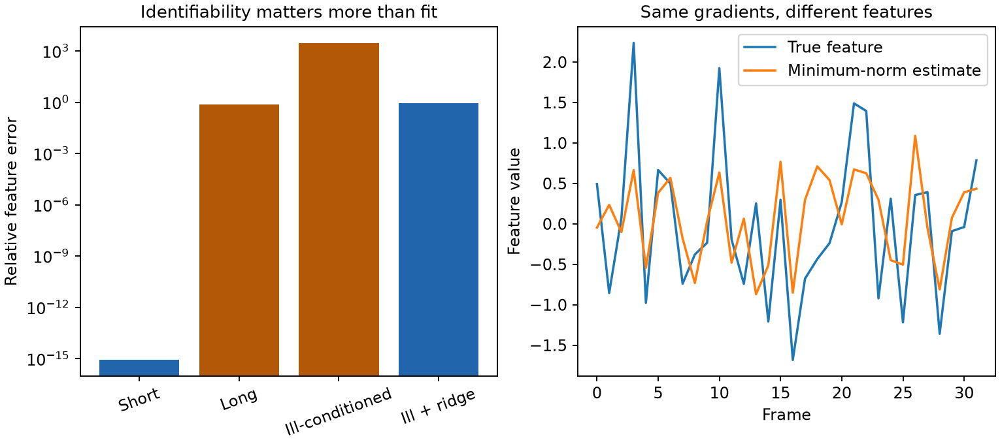

# Federated ASR Update Capture and Reconstruction

## Run the standalone identifiability experiment

```bash
python3.13 -m venv .venv
source .venv/bin/activate
pip install -r requirements-ls.txt
MPLBACKEND=Agg python -m pytest tests -q
OPENBLAS_NUM_THREADS=1 python reproduce_ls.py
MPLBACKEND=Agg python scripts/reconstruct_from_grads.py \
  --grads results/ls/synthetic-grads.pt --mode ls --out_dir results/ls/cli
```



This CPU experiment uses only generated arrays, no real clients, speech,
external models, or Flower installation. It tests `G.T @ H = dW` in three
regimes, with [full numerical results](results/ls/metrics.json):

| Synthetic regime | Gradient residual | Relative hidden-feature error |
|---|---:|---:|
| 8 frames, full column rank | 5.4e-16 | 8.1e-16 |
| 32 frames, rank 12 | 9.5e-16 | **0.768** |
| Ill-conditioned, noisy | 0.000275 | **3018** |
| Same noise, ridge 1e-4 | 0.00483 | 0.853 |

The long case has 20 unobserved directions: matching the gradients almost
perfectly does not recover the original features. Ridge limits noise
amplification in the ill-conditioned case but introduces bias; it is not
evidence of intelligible speech recovery.

**Threat-model boundary:** this calculation requires per-frame `dlogits` in
addition to `dW`. Standard FedAvg sends aggregated model updates, not these
internal gradients. It is an instrumented-client diagnostic, not a demonstration
that ordinary server-visible updates alone reveal audio.

The CLI now preserves batch/frame positions (zero-gradient rows are not silently
removed), writes both plots without overwriting one, saves actual reconstructed
arrays, and reports rank, nullity, singular values and residuals. The old `hbar`
formula is correctly labeled a **constant-feature least-squares fit**, not the
true average feature. Six tests cover those properties and the real CLI path.
Only trusted, tensor-only PyTorch artifacts are loaded with `weights_only=True`.

Waveform mode remains an **unverified integration prototype**. In particular,
second derivatives through the installed CTC and SpeechBrain encoder must be
validated before claiming that optimization runs; ordinary CTC loss success is
not sufficient. No full Flower capture or waveform reconstruction is claimed by
the standalone experiment.

Companion tooling for capturing client updates from Flower's `fedwav2vec2` research baseline and analyzing what final-layer gradients reveal about speech features.

This repository is intentionally small. It does not fork or vendor the full Flower/SpeechBrain baseline; instead, it provides the experiment scripts that sit beside a compatible checkout.

## Research workflow

```text
Flower server sends global ASR weights
                 |
                 v
client performs local CTC training
                 |
                 v
capture model delta + final CTC gradients
                 |
                 v
least-squares feature estimate or waveform optimization
                 |
                 v
visual diagnostics for privacy leakage
```

The target signal is the gradient of the final CTC projection (`ctc_lin.weight`). Two reconstruction modes are included:

- `ls`: estimate hidden features from saved weight and logit gradients with a pseudoinverse; and
- `waveform`: optimize a synthetic waveform through the SpeechBrain model so its final-layer gradient matches the captured update.

## Repository status

| Surface | Status | Notes |
|---|---|---|
| Reconstruction source | Syntax-checked | `scripts/reconstruct_from_grads.py` |
| Synthetic client generator | Portable | Accepts `--baseline-root` or `FEDWAV2VEC_ROOT` |
| Flower runner | Portable wrapper | No hard-coded cluster paths or destructive temporary clone step |
| Full baseline | External dependency | Requires a compatible Flower `fedwav2vec2` checkout with the gradient hooks applied |
| Standalone LS diagnostic | Reproduced | Synthetic fixtures, six tests, plots, numeric arrays and hosted CI |
| Full Flower/ASR result set | Not committed | Requires external hooks/model/data; not reproduced here |

Earlier versions contained absolute `/scratch2/...` paths, a duplicated shell script body, and synthetic heartbeat files. Those artifacts have been removed so the repository reflects actual research work rather than machine-specific state or artificial activity.

## Files

```text
scripts/
├── list_baseline_inventory.sh   inspect the expected Flower baseline surface
├── make_tiny_client.py          generate a deterministic two-second smoke-test client
├── run_tiny_with_hooks.sh       launch one CPU Flower round with capture enabled
├── reconstruct_from_grads.py    least-squares and waveform reconstruction modes
└── reconstruct_ctc_features.py  compatibility entry point
```

## Prerequisites

1. A compatible checkout of Flower's `fedwav2vec2` baseline.
2. Local modifications that save the client model delta and the final CTC-layer gradient/logit gradient.
3. Python 3.10+ and the packages in `requirements.txt`.

Create the environment:

```bash
python3 -m venv .venv
source .venv/bin/activate
python -m pip install --upgrade pip
python -m pip install -r requirements.txt
```

Point the scripts at the baseline root - the directory that contains the `fedwav2vec2` Python package:

```bash
export FEDWAV2VEC_ROOT=/absolute/path/to/flower/baselines/fedwav2vec2
```

## Inspect and smoke-test the baseline

```bash
bash scripts/list_baseline_inventory.sh
python scripts/make_tiny_client.py
bash scripts/run_tiny_with_hooks.sh
```

The runner creates a deterministic two-second sine-wave client, mirrors its CSVs into the minimal server split, and starts one CPU round. A correctly patched baseline should write update artifacts under:

```text
$FEDWAV2VEC_ROOT/updates/
├── client_0_round_0_delta.pt
└── grads_client_0_round_0.pt
```

The tiny client is a plumbing check, not a meaningful privacy benchmark.

## Reconstruct hidden features

The least-squares mode expects a PyTorch blob containing:

- `dW`: final CTC weight gradient with shape `(vocabulary, hidden)`; and
- `dlogits`: logit gradient with shape `(batch, time, vocabulary)`.

```bash
python scripts/reconstruct_from_grads.py \
  --grads "$FEDWAV2VEC_ROOT/updates/grads_client_0_round_0.pt" \
  --mode ls \
  --out_dir viz/ls
```

## Reconstruct a waveform

Waveform mode additionally needs the SpeechBrain model configuration and saved target fields:

```bash
python scripts/reconstruct_from_grads.py \
  --grads "$FEDWAV2VEC_ROOT/updates/grads_client_0_round_0.pt" \
  --mode waveform \
  --sb_config "$FEDWAV2VEC_ROOT/fedwav2vec2/conf/sb_config/w2v2.yaml" \
  --steps 500 \
  --lr 0.05 \
  --out_dir viz/waveform
```

The saved blob must also contain `W`, optional `b`, `targets`, and `target_lens`. If `dlogits` is present, `--lambda_dlogits` can add a logit-gradient alignment term.

## Verification

Checks that do not require Flower or model downloads:

```bash
python -m compileall -q scripts
bash -n scripts/*.sh
python scripts/reconstruct_from_grads.py --help
python scripts/make_tiny_client.py --help
```

The help commands work before loading the heavyweight reconstruction dependencies or accessing the external baseline.

## Limitations

- The repository does not contain the patched Flower baseline, so the update-capture hooks cannot be independently audited here.
- Least-squares hidden-feature recovery is not equivalent to recovering intelligible audio.
- Waveform optimization is compute-intensive and sensitive to model/checkpoint compatibility.
- The synthetic smoke-test client is not evidence of real-world leakage.
- No aggregate privacy or WER result is claimed without a committed evaluation set.

## Responsible research

Use these scripts only on models and data you are authorized to test. Gradient artifacts can contain sensitive information even when raw speech never leaves a client.

## License

No repository-wide license has been granted. Flower, SpeechBrain, and any external baseline code retain their respective licenses.
